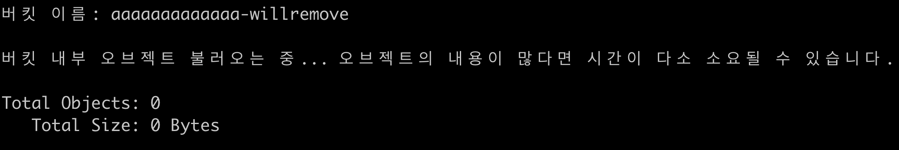
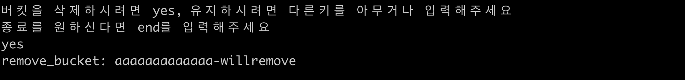

# KMU-s3-delete

## AWS s3버킷이 쌓여있을 경우 사용하기 위한 프로그램 입니다.

### 환경 세팅
AWS CLI를 사용하기 위해 다음과 같는 명령어를 사용하여 계정 로그인을 합니다. 
```shell script
asw configure
```

작업을 시작하기 위해 명령어를 입력합니다.
```shell script
source task.sh
```
local 폴더에 s3_bucket_list.txt라는 파일이 생길 것입니다. s3 버킷 이름에 대한 리스트가 저장되어 있고 task.sh는 이 정보를 파싱하여 작업을 합니다.

modified time이 오래된 순서대로 보려면 command line에 old를 입력하고 그렇지 않을것이라면 old를 제외한 키를 입력합니다.


버킷 이름과 오브젝트의 이름들, 총 개수와, 총 사이즈를 확인합니다.


버킷을 삭제하기 위해 command line에 yes를 입력하고 삭제 메세지를 확인합니다.

삭제하지 않으려면 yes를 제외한 다른 문자를 입력합니다

이를 반복합니다.

작업을 종료하려면 end를 입력하여 종료합니다.